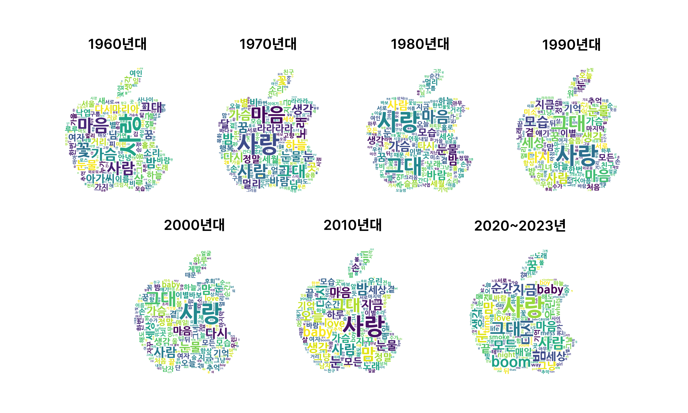
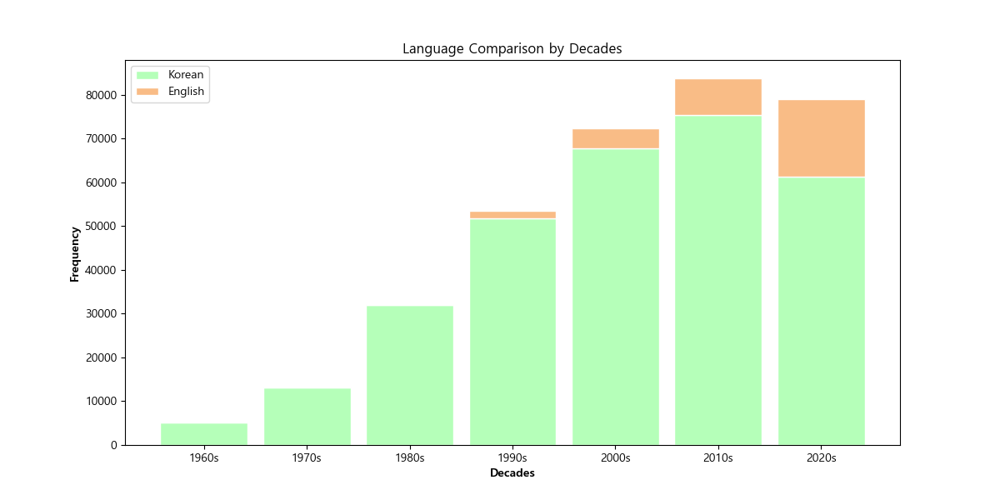

# 🎵MelonLyricsNLP Project

## 개요
- 프로젝트 이름: MelonLyricsNLP
- 프로젝트 지속기간: 2024.04.23~2024.04.24
- 개발 언어: Python
- 멤버: 4am (고서영,김가영,김문선,김연중)

## 프로젝트 소개
### 멜론 연도별 차트의 상위 100개 곡의 가사를 텍스트 분석
- **연도별 트렌드 분석**: 연도별로 가장 많이 사용된 단어와 표현을 분석하여, 시대별 음악 트렌드 변화를 파악.
- **언어별 단어 빈도 분석**: 한국어 및 영어 가사에서 가장 빈번하게 사용된 단어를 추출하여, 언어별 특징을 분석.
- **영어 가사 비중 추이 분석**: 연도별로 한국 노래에서 영어 가사의 비중 변화를 분석
- **시각화**: matplotlib 및 WordCloud 라이브러리를 이용하여, 정제된 데이터를 바탕으로 한 시각적 분석을 제공. 시각화를 통해 데이터의 이해도를 높이고, 분석 결과를 직관적으로 표현.
- **TF-IDF**: 단어의 빈도와 해당 단어가 등장한 연대의 가사의 빈도를 결합해서, 단어 빈도가 단어의 일반 빈도를 따라서 크게 의미 없는 단어 순서대로 나열되는 것을 피해 해당 연대의 가사에서 중요도를 구함.

### 시대별 주요 키워드(명사)

### 영어 가사 비중 추이

## 팀 소개
| 분야 | 이름 | 포지션 |
| --- | --- | --- |
| 개발 | 고서영 | 🖥️ 크롤링, NLP, 시각화|
| 개발 | 김가영 | 💻 크롤링, NLP, 시각화|
| 개발 | 김문선 | 🖥️ 크롤링, NLP, 시각화|
| 개발 | 김연중 | 💻 크롤링, NLP, 시각화|

## 산출물 파일 링크

  - [데이터 정제 보고서](reports/데이터정제보고서.md)
  
  - [추출 데이터 보고서](reports/추출데이터보고서.md)
